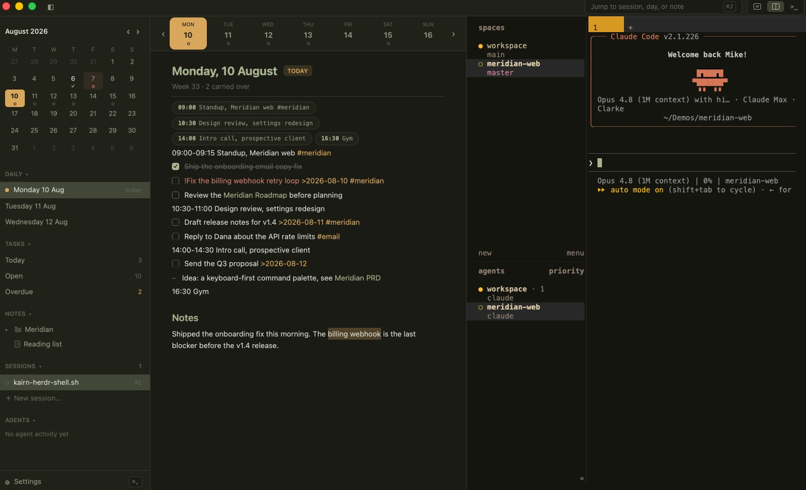

# Kairn

[](https://github.com/mikedclarke/kairn/releases)
[](LICENSE)
[](#build-and-run)

Your notes and your terminals in one calm, native window.

Kairn is a daily-notes and tasks app with real terminal sessions beside the page:
plan the day, run the work, and capture what you learned without switching apps.
Everything is plain markdown files on disk, and AI agents are first-class users of
those files, not a chat panel bolted on.

Built in Rust on [GPUI](https://www.gpui.rs) (Zed's UI framework). One codebase for
macOS and Linux. Not Electron.



## Why

If you work with coding agents, your day is split between terminals where the agents
run and notes where the plans, context, and decisions live. Keep those in separate
apps and the knowledge your agents need is never where the agents are.

Kairn puts them on one surface. Notes are plain markdown on disk, so an agent needs
no importer, sync bridge, or API key to read them. The `kairn` CLI gives agents
tasks, capture, search, and backlinks with JSON output and honest exit codes. And
every write, human or agent, goes through the same atomic never-clobber merge, so an
agent editing a note you have open cannot destroy your work. What agents do shows up
in a live activity feed beside your own notes.

No cloud, no accounts, no database. A folder of markdown you could still read in
twenty years.

## Features

### Notes and editing

- Daily notes with templates, a month calendar, a week strip, and a day timeline built
  from time-blocked lines (`09:00 standup`, `14:00-15:30 call`)
- One continuous markdown editor: live styling as you type, syntax markers hidden except
  on the cursor line, no separate edit mode
- Wiki links, #tags, @mentions, date refs, highlights, bold/italic, markdown links, and
  bare URLs, all clickable; missing wiki-link targets are created on click
- Linked mentions under every note: each line elsewhere that links to it
- Full editing: selection, clipboard, undo/redo, IME, list continuation, drag handles to
  reorder lines
- Autosave with atomic, never-clobber writes: every save three-way merges against the
  file on disk, so external edits (agents, sync, other editors) are never lost, and
  genuine collisions surface in a banner instead of silently dropping text
- A watched notes folder: changes from outside the app appear live
- Honest failure states: an unmounted notes folder blocks the pane rather than showing a
  convincing empty vault; sync conflict copies get a banner with one-click open

### Tasks

- NotePlan task syntax: `* task`, `+ checklist`, `[ ]`/`[x]`/`[>]`/`[-]`, `!`/`!!`/`!!!`
  priority
- Real due dates: a `>2026-08-12` token means due that day, daily-note tasks default to
  their day, and dated tasks from any note join the views
- Today / Open / Overdue views with live counts and click-through to the source note
- Click a checkbox anywhere to complete it (writes `[x]` plus an `@done(...)` timestamp
  back to disk)
- Drag a task onto a week-strip day to reschedule it
- Calendar and week-strip indicators for open, done, and overdue days

### Terminal

- Real PTY terminals beside your notes: resizable split, full-screen toggle, multiple
  sessions with live busy indicators, saved SSH hosts
- Full-fidelity emulation on the alacritty engine: true colour, scrollback, application
  cursor mode, OSC 52 clipboard, bracketed paste, SGR mouse reporting (click, drag, and
  all three buttons, so TUI apps are fully clickable), focus reporting
- Per-theme terminal palettes and font, live font-size zoom

### Agents

- The `kairn` CLI is the agent surface: read notes, list tasks, add, complete, capture,
  search, backlinks, all with `--json` output and stable exit codes designed for
  models reading `--help`
- Every CLI write is logged to `.kairn/activity.jsonl` in the vault (so it syncs), and
  the app shows the feed live in an Agents sidebar section, with named actors via
  `--actor` / `$KAIRN_ACTOR`
- Same core, same write safety: agents go through the identical never-clobber paths as
  the editor

### Capture and navigation

- Quick capture chord: one overlay, one field, appends to today's note
- A jump switcher for sessions, days, and notes: fuzzy titles, full-text search with
  snippets, and date-shaped queries (`aug 12`, `tomorrow`, `2026-W32`)
- Writing mode: the note at a comfortable measure, nothing else

### Theming and settings

- Dark and Light built-in themes, plus custom themes as JSON files in the vault
  (`.kairn/themes/*.json`), overriding any subset of palette, fonts, and terminal
  colours; see [docs/themes.md](docs/themes.md)
- Searchable font pickers for interface, editor, and terminal; editor text size setting
- Settings survive corruption: a malformed settings file is backed up and can never
  silently wipe your configuration

### Your files, your vault

- Plain markdown on disk. No database, no lock-in, no servers, no telemetry.
- NotePlan-compatible vault layout: point Kairn at an existing NotePlan directory and
  both apps read and write the same files (`Calendar/` for period notes, `Notes/` for
  everything else, `@Trash` soft delete, `@Templates/Daily.md`)
- Local-first: sync belongs to Syncthing (or any file sync); remote machines are an SSH
  session away

## The `kairn` CLI

```text
kairn today              Print today's daily note
kairn note <title>       Print a note by title, date, or period (2026-W32)
kairn tasks              List open tasks by due date (--today, --overdue)
kairn add <text>         Add a task to a daily note (--date today|tomorrow|aug 12)
kairn done <match>       Complete the matching open task
kairn capture <text>     Append a line to today's note
kairn search <query>     Fuzzy title + full-text search
kairn backlinks <title>  Lines elsewhere that link to a note
```

Global flags: `--root <dir>` (or `$KAIRN_ROOT`), `--json`, `--actor <name>`. Exit codes
are part of the interface: 0 success, 1 failure, 2 bad usage, 3 no match, 4 ambiguous.

## Install

Download the latest build for your platform from the
[releases page](https://github.com/mikedclarke/kairn/releases):

- **macOS** — open `Kairn-<version>.dmg` and drag Kairn to Applications. The build is
  signed and notarized, so it opens without a Gatekeeper prompt. Universal binary (Apple
  Silicon and Intel), macOS 15 or later.
- **Linux** — the `.AppImage` runs on any distribution (`chmod +x` it, then run); the
  `.deb` installs on Debian and Ubuntu (`sudo dpkg -i kairn_<version>_amd64.deb`). Both add
  Kairn to your application launcher.

To use the `kairn` CLI from any terminal, open Settings → General and click **Install kairn
command**, which links the bundled CLI onto your PATH. The `.deb` already installs the
`kairn` CLI on PATH for you.

## Build and run

To build from source instead of installing a release:

Rust stable via [rustup](https://rustup.rs); edition 2024 needs a 2025+ toolchain.

**macOS** (Xcode or command-line tools):

```sh
cargo run                        # the app
cargo run -p kairn-cli -- today  # the CLI
```

**Linux** (GPUI renders via Vulkan; Wayland/X11 and fontconfig headers required).
Debian/Ubuntu:

```sh
sudo apt install build-essential cmake clang libfontconfig-dev libwayland-dev \
  libx11-xcb-dev libxkbcommon-x11-dev libvulkan1 mesa-vulkan-drivers libasound2-dev \
  libzstd-dev libssl-dev
cargo run
```

Fedora equivalents: `gcc clang cmake fontconfig-devel wayland-devel libxcb-devel
libxkbcommon-x11-devel vulkan-loader alsa-lib-devel libzstd-devel openssl-devel` plus
Mesa Vulkan drivers.

Keyboard chords use Cmd on macOS and Ctrl+Shift for letters on Linux (so the shell keeps
Ctrl+J and friends); the full reference lives in Settings → Keybinds.

## Roadmap

- Deeper period notes (weekly/monthly/quarterly reviews)

## Contributing, changelog, license

- [CONTRIBUTING.md](CONTRIBUTING.md) for issues and pull requests
- [CHANGELOG.md](CHANGELOG.md) and [release-notes/UNRELEASED.md](release-notes/UNRELEASED.md)
  for what's shipping
- [MIT](LICENSE) licensed. The terminal builds on a vendored fork of
  [gpui-terminal](https://github.com/zortax/gpui-terminal) (MIT/Apache-2.0) over the
  [alacritty_terminal](https://github.com/alacritty/alacritty) engine.

Kairn v1, the previous macOS-only Swift app, is frozen at
[kairn-v1](https://github.com/mikedclarke/kairn-v1); this is a ground-up rebuild.
